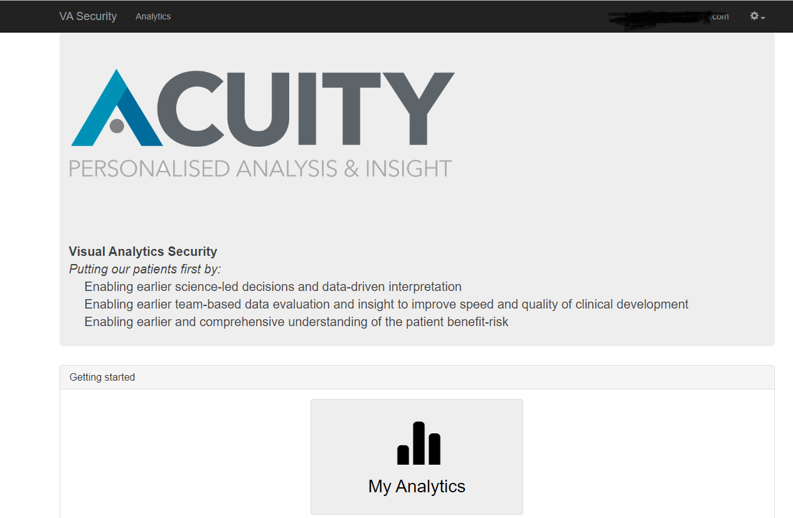

[](https://github.com/digital-ECMT/acuity-va-security/actions/workflows/build-artifacts-and-image.yml)
[](https://opensource.org/licenses/Apache-2.0)

**ACUITY**  

ACUITY is a digital solution to revolutionize the way we can interpret and analyze data from clinical trials. 
It will facilitate data interpretation through an interactive visual platform designed to effortlessly enable access across a drug program and individual studies, down to individual patient level data.  

System includes several applications:  
* <a href='https://github.com/digital-ECMT/vahub'>VA-Hub</a> - a web application showing the clinical trials data visualizations
* <a href='https://github.com/digital-ECMT/acuity-admin'>AdminUI</a> - a web application to load clinical studies data into the ACUITY
* VA-Security – a web application providing authentication/authorization settings for the system

Check <a href='https://github.com/digital-ECMT/acuity-docker/wiki'>ACUITY Visualisations Wiki</a> for more information.
<b> To set up applications please refer to instructions in the [following repository](https://github.com/digital-ECMT/acuity-docker).
</b>
<hr>

## Developer's section
### VA-Security Installation

  

These instructions will help you run a copy of the VA-Security project on your local machine for development and testing purposes.  

### Prerequisites

* Java SE Development Kit >=1.8
* Maven 3.5.4

1. [Set up database](https://github.com/digital-ECMT/acuity-docker/wiki/Applications-Setup) to be used in ACUITY applications.
   (prefer [deployments scripts](https://github.com/digital-ECMT/acuity-deployment-scripts) for these purposes)  
   If you've already done this during installation of other ACUITY applications, skip this step.


2. Set up database connection settings in a Spring profile file `application-<envSpecificProfile>.yml` located in `/local-configs` directory (See [Spring Configs](https://github.com/digital-ECMT/acuity-docker/wiki/Applications-Spring-Configs)).

3. In a command-line tool run Maven `clean` and `install` tasks from the application root directory:
   ```
   mvn clean install
   ```
   This command will install all VA-Security artifacts to the local repository.

4. Run from `/web` directory:
   ```
   mvn spring-boot:run -Dspring.profiles.active=default,<envSpecificProfile>,postgres-mode,local-no-security,local-config -Dspring.config.location=./../local-configs/ -Dserver.port=8080
   ```

   where `<envSpecificProfile>` is a name of Spring profile for specific environment (`dev`, `test`) located in `/local-configs` directory

5. When you'll see a big ASCII-art text "VASEC HAS STARTED" in the console, open VA-Security app at http://localhost:8080/

## Usage
Check <a href=''>ACUITY visualisations Wiki</a> for user manuals.

## Contributing
See [Contributing Guide](/docs/contributing.md).

## License
Licensed under the [Apache 2.0](http://www.apache.org/licenses/LICENSE-2.0) license.
